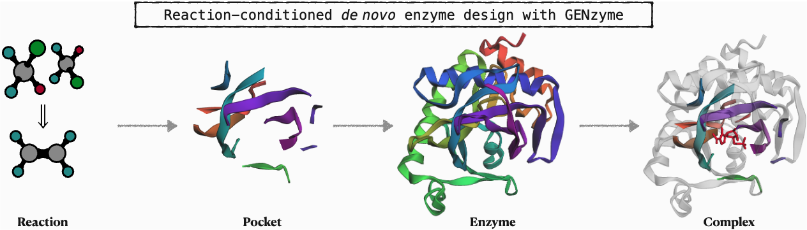
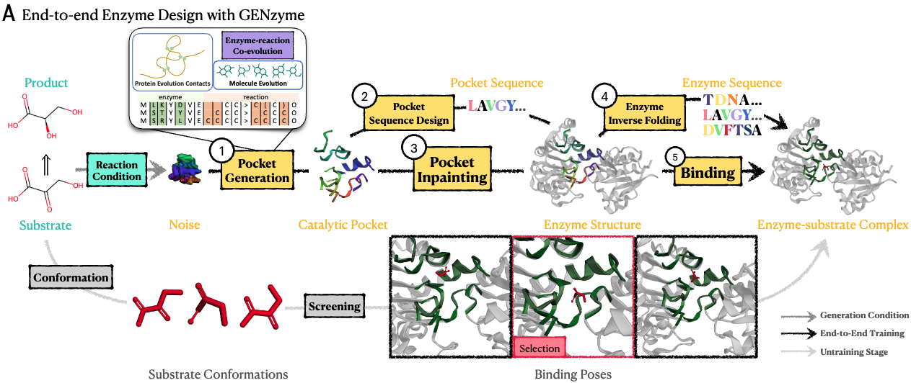

# Reaction-conditioned De Novo Enzyme Design with GENzyme

GENzyme enables de novo design of catalytic pockets, enzymes, and enzyme-substrate complexes for any reaction. Simply change ```args.substrate_smiles``` and  ```args.product_smiles``` in ```gen_configs.py``` to customized substrate SMILES and product SMILES, then run ```python generate.py```, you can design your own enzymes. 

####  GENzyme Paper at [arxiv](https://arxiv.org/abs/2411.16694).






### Requirement
```
python>=3.11
CUDA=12.1
torch==2.4.1 (>=2.0.0)
torch_geometric==2.4.0
torch_scatter==2.1.2

pip install mdtraj==1.10.0 (do first will install numpy, scipy as well, install later might raise dependency issues)
pip install esm==3.0.7.post1
pip install pytorch-warmup==0.1.1
pip install POT==0.9.4
pip install rdkit==2023.9.5
pip install biopython==1.84
pip install tmtools==0.2.0
pip install geomstats==2.7.0
pip install dm-tree==0.1.8
pip install ml_collections==0.1.1
pip install torchmetrics==0.11.4
pip install OpenMM
pip install einx
pip install einops

conda install conda-forge::pdbfixer
```

#### In case if you want to use the pocket-specific binding module, which is not necessarily installed for enzyme design:
```
For binding module, we use UniMol Docking v2, you need to install [UniCore](https://github.com/dptech-corp/Uni-Core)
```

# Model Weights

You should download GENzyme checkpoint at [Google drive](https://drive.google.com/file/d/1R39bvQwUKqIXeqf4RIsuK-K6RWq4P1gj/view?usp=sharing). Once you download it, put it under ```genzyme_ckpt``` folder, namely ```genzyme_ckpt/genzyme.ckpt```.


## Notes before customized design
 1. Please make sure you have [ESM3](https://github.com/evolutionaryscale/esm/tree/main) installed and have access to [ESM3](https://github.com/evolutionaryscale/esm/tree/main).
 2. To customize catalytic reaction, remeber to change the subsrtate SMILES and product SMILES in [```gen_configs.py```](https://github.com/WillHua127/GENzyme/blob/main/gen_configs.py).
 3. You may also change ```args.ptm_filter``` and ```args.plddt_filter```  in ```gen_configs.py``` for filtering enzymes.
 4. GENzyme inference script [```generate.py```](https://github.com/WillHua127/GENzyme/blob/main/generate.py) is provided for your own design.


## Inference script configs
```
args.pdb_name             #Enzyme PDB file for refinement/repurposing, set None if no PDB file available
args.substrate_smiles     #Input substrate SMILES
args.product_smiles       #Input product SMILES
args.n_pocket_res         #Number of catalytic pocket residues for design
args.n_protein_res        #Number of enzyme residues for design
args.num_pocket_design_t  #Number of inference steps (ODE steps for sampling)
args.n_sample_enzyme      #Number of enzymes
args.num_inpaint_t        #Number of pocket inpainting steps
args.ptm_filter           #pTM filtering
args.plddt_filter         #pLDDT filtering
```

# Enzyme Refinement or Enzyme Repurposing
1. [```gen_configs.py```](https://github.com/WillHua127/GENzyme/blob/main/gen_configs.py) contain all inference configurations and hyperparameters.
2. Put your pocket pdb file under [```data/ground_truth/pocket/```](https://github.com/WillHua127/GENzyme/tree/main/data/ground_truth/pocket) folder, put protein pdb file under [```data/ground_truth/protein/```](https://github.com/WillHua127/GENzyme/tree/main/data/ground_truth/protein) folder.
3. In [```gen_configs.py```](https://github.com/WillHua127/GENzyme/blob/main/gen_configs.py), change ```args.pdb_name``` to your pdb file name. Also change ```args.substrate_smiles``` to one substrate SMILES, and ```args.product_smiles``` to one product SMILES, to customize reaction.
4. Run ```python generate.py``` for enzyme refinement and repurposing.
5. Output pockets and enzymes are saved under [```generated/```](https://github.com/WillHua127/GENzyme/tree/main/generated) folder.


# De novo Enzyme Design
1. [```gen_configs.py```](https://github.com/WillHua127/GENzyme/blob/main/gen_configs.py) contain all inference configurations and hyperparameters.
2. In [```gen_configs.py```](https://github.com/WillHua127/GENzyme/blob/main/gen_configs.py), change ```args.pdb_name``` to one pdb file (set to None for de novo design ```args.pdb_name = None```). Also change ```args.substrate_smiles``` to one substrate SMILES, and ```args.product_smiles``` to one product SMILES, to customize reaction.
3. Run ```python generate.py``` for de novo enzyme design.
4. Output pockets and enzymes are saved under [```generated/```](https://github.com/WillHua127/GENzyme/tree/main/generated) folder.


## Reproduce Enzyme Design
1. GENzyme reproduce script [```reproduce.py```](https://github.com/WillHua127/GENzyme/blob/main/reproduce.py) is provided.
2. Run ```python reproduce.py``` for reproduction.

## Model Training

1. [```configs.py```](https://github.com/WillHua127/GENzyme/blob/main/configs.py) contain all training configurations and hyperparameters.

2. Train model using [```train.py```](https://github.com/WillHua127/GENzyme/blob/main/train.py) for single GPU training. Run ```python train.py``` for training.

   
## License
No Commercial use of either the model nor generated data, details to be found in LICENSE.
